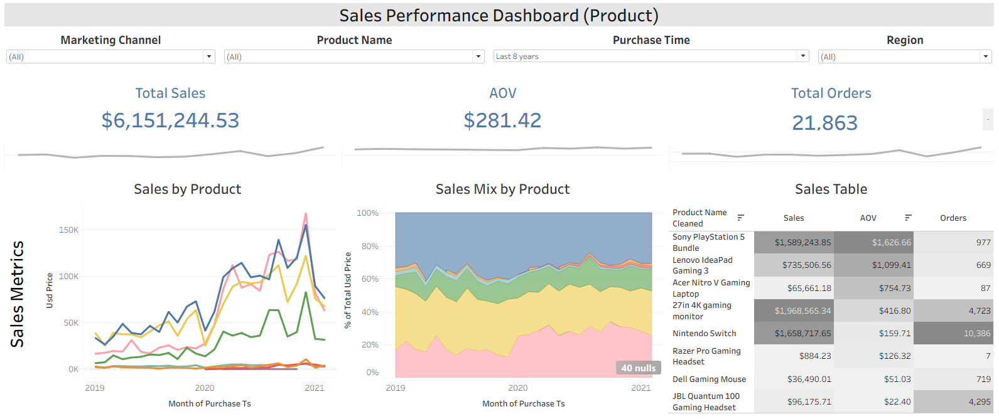
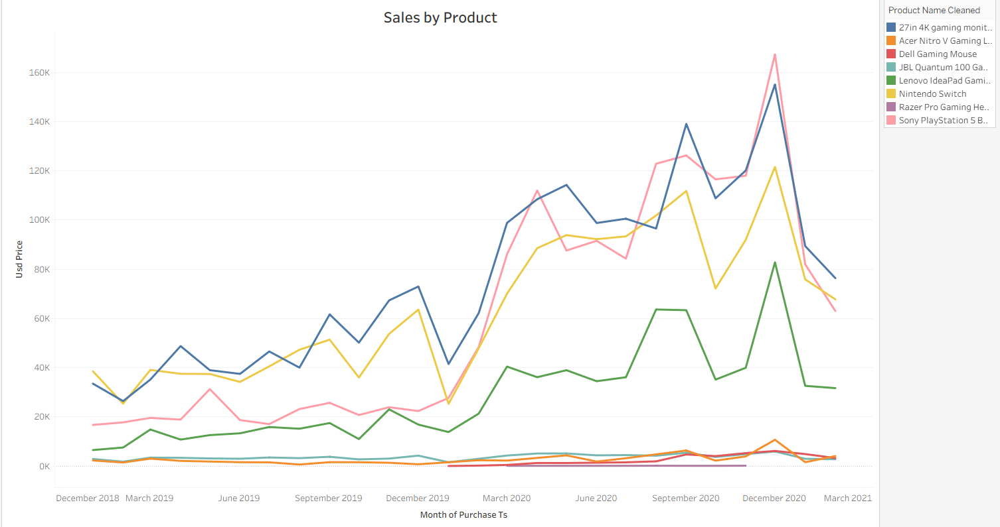
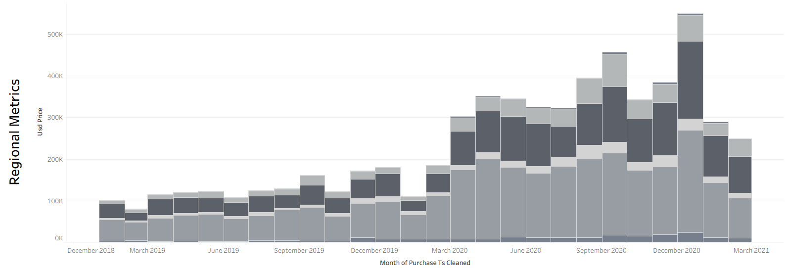

# Project Background

GameZone operates in gaming/consumer-electronics e-commerce. The catalog in the data includes consoles, monitors, headsets, gaming mice, and gaming laptops — e.g. Nintendo Switch, Sony PlayStation 5 Bundle, 27in 4K gaming monitor, JBL Quantum 100 Gaming Headset, Dell Gaming Mouse, Lenovo IdeaPad Gaming 3, Acer Nitro V Gaming Laptop, and Razer Pro Gaming Headset.

* **Active years in this dataset:.**
Purchase activity runs from roughly January 2019 through December 2020, with PURCHASE_MONTH giving a monthly grain. Some SHIP_TS values are earlier than purchase dates, and REFUND_TS values extend later — up to 2025 — so the dataset captures the sales window 2019–2020 plus a longer operational/refund tail. It does not show purchases after 2020.

* **Business model:.**
GameZone is a direct-to-consumer online retailer. Orders come through website and mobile app. Sales are in USD, shipped internationally to many COUNTRY_CODE values such as US, DE, AU, FR, GB, IN, BR, etc. Marketing/acquisition is tracked through channels like direct, affiliate, email, social media, and account creation methods include desktop, mobile, tablet, tv, unknown. Refunds are tracked via REFUNDED and REFUND_TS.

What the data suggests operationally:
* Website is the dominant purchase platform; mobile app is a smaller but real channel.
* Direct marketing is the most common channel, followed by email/affiliate/social.
* The US is the largest market, with strong international presence.
* Product mix spans low-ticket accessories like JBL headsets around $24 and Dell mice around $50, mid-ticket monitors around $300–$500, and high-ticket consoles/laptops from roughly $800 to $2,200+.
* Refunds are material enough to be a first-class metric, not an edge case.

| Metric | What it tells us |
|---|---|
| **Revenue** | Total sales before refunds |
| **Orders** | How many purchases were made |
| **Average Order Value** | How much customers spend per order |
| **Refund Rate** | How often orders are refunded |
| **Top Products** | Which items sell best |
| **Top Regions** | Where our customers are located |
| **Top Marketing Channels** | Which channels bring in the most sales |
| **Sales Trend** | How revenue and orders change over time |

Insights and recommendations are provided on the following key areas:

- **Sales Trends:** 
- **Product (Regional and Marketing) Performance:** 

The SQL queries used to inspect and clean the data for this analysis can be found here [link].

Targed SQL queries regarding various business questions can be found here [link].

An interactive Tableau dashboard used to report and explore sales trends can be found here [link].

# Data Structure & Initial Checks

The companies main database structure as seen below consists of two tables: Region, Orders A description of each table is as follows:
- **Table 2: REGION**
- **Table 3: ORDERS**

[Entity Relationship Diagram here][My data snapshot](sales_schema.jpg)

# Executive Summary

### Overview of Findings

After peaking in late 2020, company sales continued to decline, with significant drops in 2021. Key performance indicators—total sales by product, average order value (AOV), and total orders—show that the main drivers were the Sony PlayStation 5, Nintendo Switch, and gaming monitors, with North America leading regional sales for most. The refund rate was 19.36%. Although this decline can be partly attributed to a return to pre-pandemic normalcy, the following sections will examine contributing factors and explain how these findings will inform our monthly product and regional stocking decisions.

[Visualization, including a graph of overall trends or snapshot of a dashboard] 

# Insights Deep Dive
### Sales Trends:

* The company’s sales more than doubled in early 2020, reaching an all-time high in September with 1,496 orders totaling $456,871 in monthly revenue, and again in December with 1,671 orders totaling $549,435 in monthly revenue. This corresponds with the economy-wide spending boom caused by pandemic-induced changes in consumer behavior.
  
* Sales dropped significantly in February 2021, almost nearing pre-COVID levels. The main drivers of this dip were the gaming monitor, Nintendo Switch, and Sony PlayStation 5—all three of which exhibit the same plateauing behavior in 2020 and 2021.

[Visualization specific to Sales Trend] 

### Product (Regional and Marketing) Performance:

* Eighty-eight percent of the company’s orders come from just three products: the gaming monitor, Nintendo Switch, and JBL gaming headset. These three products accounted for $3.7M in overall revenue, or 60% of the company’s total.

* Direct is the main driver of sales; all other channels pale in comparison.

* While all three top products exhibited dips in 2021, the Sony PlayStation 5 had a major dip in direct traffic in 2021 compared with other products and marketing channels. Since then, that product has seen a consistent decline in direct-channel sales.

* For the Sony PS5, the drop is mostly contained to the NA region and direct traffic, which may indicate a shift in trends or competitors there.

[Visualization specific to Product (Regional and Marketing) Performance] 

# Recommendations:

Based on the insights and findings above, we would recommend the [Data, Product, Sales and Marketing team] to consider the following: 

* When people stay at home, they are more likely to spend on gaming products, which helps explain the pandemic-era sales surge. General team (contextual): maintain awareness that at-home demand conditions can influence gaming spend, and monitor whether the current decline reflects a return to pre-pandemic behavior.

* The Razer Pro Gaming Headset generated only $884.23 in total sales from 7 orders, making it a clear underperformer. Product team (actionable): cut or phase out the Razer Pro Gaming Headset, after confirming it has no strategic bundling, acquisition, or niche role.

* North America shows strong traction for the gaming monitor, Nintendo Switch, and PS5. Marketing team (actionable): prioritize promotion and marketing for these three products in the NA region.

* The email channel shows a potential uptick, while the business remains overly reliant on direct traffic. Marketing team (actionable): focus the marketing strategy on the email channel to shift away from reliance on direct traffic.

* Direct traffic appears oversized relative to other marketing channels. Data team (directional): double-check that marketing-channel attribution is correct, especially for direct traffic.

# Assumptions and Caveats:

Throughout the analysis, multiple assumptions were made to manage challenges with the data. These assumptions and caveats are noted below:

**Pandemic/pre-pandemic causality**

* Assumption: The 2020 sales boom was driven by at-home pandemic behavior, and the 2021 decline reflects a return to pre-pandemic normalcy.

* Caveat: This is correlation, not proven causation. Other factors—seasonality, supply constraints, competition, pricing, or macro conditions—could also explain the rise and fall.

**Product performance metric consistency**

* Assumption: “Top products by revenue” and “top products by order/unit volume” are separate and should not be conflated.

* Caveat: The analysis must clearly tie each metric to the correct product set. The $3.7M / 60% revenue figure, for example, should apply only to the order-volume leaders and $5.2M / 85% revenue figure for the revenue leaders. Rankings can change depending on the metric used.

**Marketing channel attribution, especially direct traffic**

* Assumption: Direct traffic is a valid, correctly attributed channel, and the email channel shows a real uptick worth shifting budget toward.

* Caveat: Direct appears oversized, so attribution may be inaccurate. The email opportunity and the PS5 direct-traffic decline in NA should be validated by the data team before acting on them.
